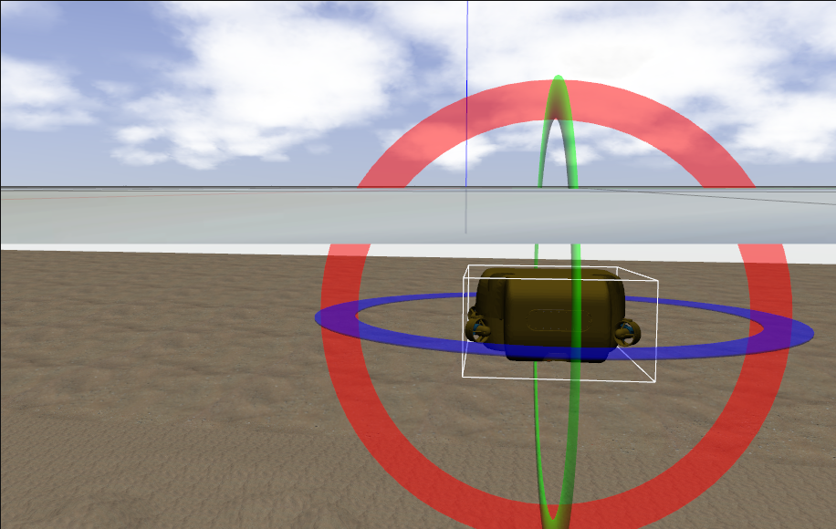

VAUV_simulator
======

Maritime environment simulator based on [Plankton](https://github.com/Liquid-ai/Plankton) and used for developing and testing software various software modules for our SWIFT underwater vehicle.



--------
Overview
--------
The simulator is a collection of ROS2 packages includes Gazebo plugins that extends the simulation capability of Gazebo to underwater vehicles, sensors and environment.

--------
Table of contents
------
* [Prerequisites](#Prerequisites)
* [Dependencies](#Dependencies)
* [Installation](#Installation)
* [Usage](#Usage )

--------
Prerequisites
------
- ROS2  eloquent
- Gazebo 9.x

--------
Dependencies
------
- [xacro](https://github.com/ros/xacro/tree/dashing-devel) dashing-devel branch
- Scipy 0.x
- [ament_package](https://github.com/ament/ament_package/tree/eloquent) eloquent branch

--------
Installation
------

```sh
   colcon build --packages-up-to plankton
```

--------
Usage
------
Starting an underwater environment:-

```sh
  ros2 launch uuv_gazebo_worlds ocean_waves.launch
```

Uploading SWIFT AUV:-

```sh
ros2 launch swift_description upload_swift.launch mode:=default x:=0 y:=0 z:=-1 namespace:=swift
```

Starting dynamic positioning PID controller:-

```sh
ros2 launch uuv_trajectory_control rov_pid_controller.launch uuv_name:=swift
```

Sending waypoints to the DP controller to follow:-

```sh
ros2 launch uuv_control_utils send_waypoints_file.launch uuv_name:=swift
```

For creating new underwater vehicle's description package run the following command within the simulator folder:-

```sh
ros2 run uuv_assistants create_new_robot_model --robot_name <ROBOT_NAME>
```
